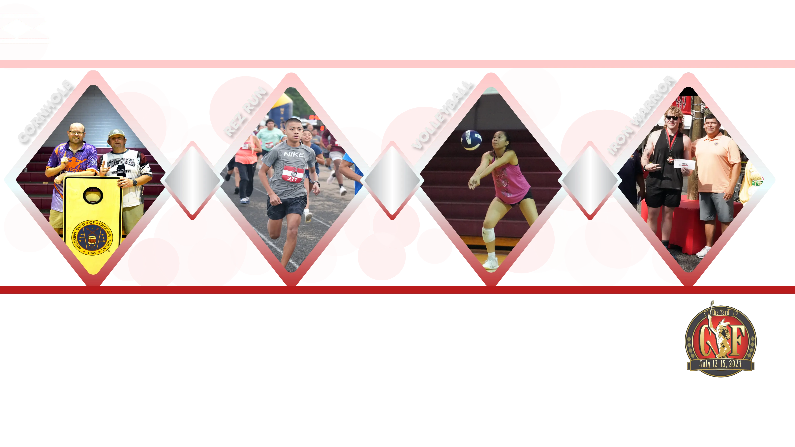

<section class="diamond-bg6">
  

    
    
    

      
        

          

            
            

              
{{ card.title }}

              
{{ card.desc }}

            

            

              
                

                  {{ card.alert }}
                

              
              

                
                <a href="{{ card.firstLink }}" class="btn btn-light" target="_blank">{{ card.firstAction }}</a>
                
                
                  <a href="{{ card.secondLink }}" class="btn btn-danger" target="_blank">{{ card.secondAction }}</a>
                
              

            

          

        

      
    

  

</section>
