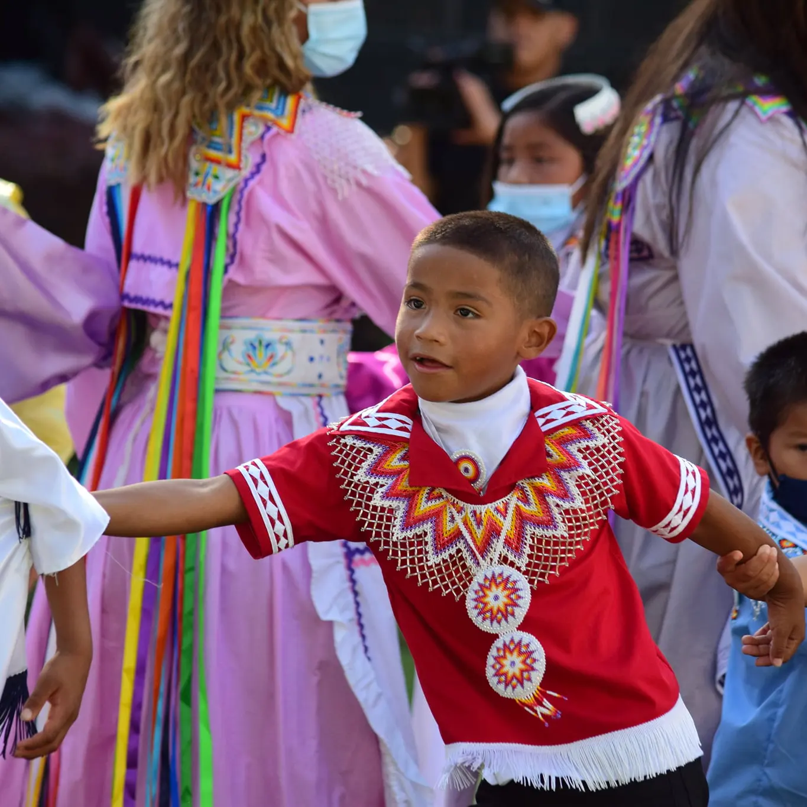
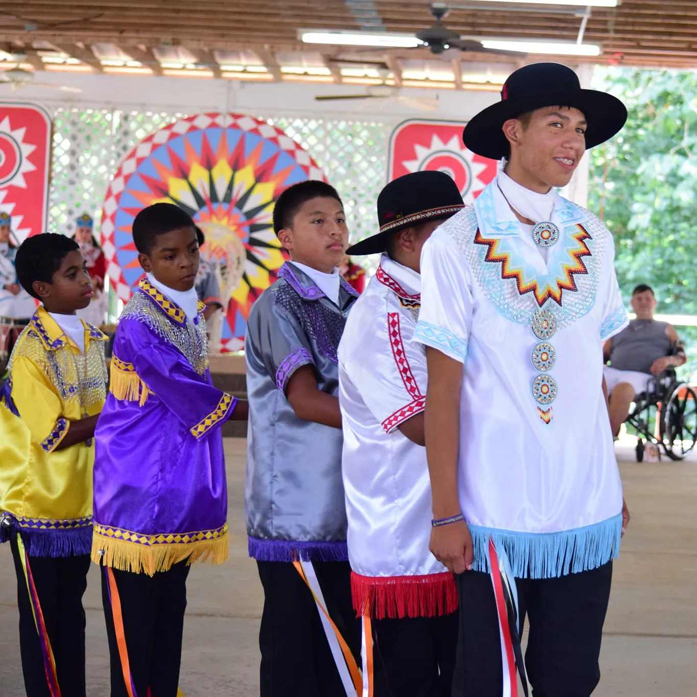
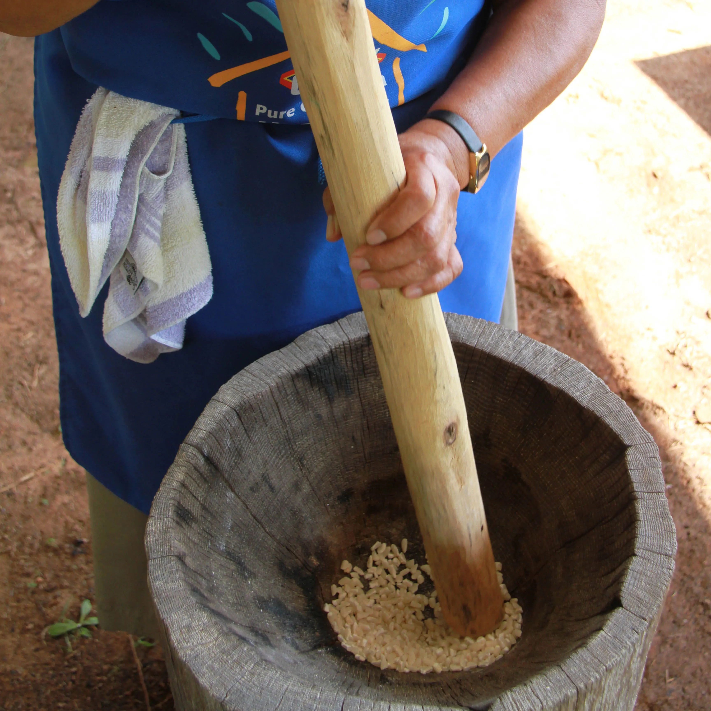

<section class="basket-bg">
  

  
  
  

    
    

      

        

          

            
            

              <h5 class="card-title">Basketry</h5>
              
When a present day basket maker seeks out, cuts and prepares her cane, she uses the same methods as generations of Choctaw women before her. For centuries, Choctaw basket makers have created works of art from the swamp cane that flourishes along Mississippi creek banks.

            

          

        

        

          

            
            

              <h5 class="card-title">Beadwork</h5>
              
Men and women alike often wear decorative beadwork with traditional clothing. Designs and colors are the artist's preferences. A beadwork set for women often consists of a belt, medallion, collar necklaces, earrings, ribbon lapel pins, a handkerchief lapel pin, and a round comb.

            

          

        

        

          

            
            

              <h5 class="card-title">Clothing</h5>
              
Most Choctaws today wear Choctaw dresses and shirts mainly for special occassions. They are made from cotton fabric, in solid colors with a contrasting trim. Occasionally, women choose silk or velvet fabric for traditional dresses, usually for events such as the Choctaw Indian Princess Pageant.

            

          

        

      

    

  
<!-- End of Arts & Crafts -->
  

    
    

      

        

          

            
            

              <h5 class="card-title">War Dances</h5>
              
War dances were used by early Choctaws to prepare for battle. Choctaw war dances are unusual in that the women join the men in dancing. In most other tribes, only men take part in the war dance.

            

          

        

        

          

            
            

              <h5 class="card-title">Social Dances</h5>
              
Social dances mark important aspects of life such as friendship, courtship and marriage. They include stealing partners, the friendship dance, and the wedding dance, among others.

            

          

        

        

          

            
            

              <h5 class="card-title">Animal Dances</h5>
              
Animal dances often mimic the behavior of their namesakes, with dancers darting in and out of the dance circle like playful raccoons in the raccoon dance or forming a line that coils and uncoils in the snake dance.

            

          

        

      

    

  
 <!-- End of Dance Grounds -->
  

    
    

      

        

          

            
            

              <h5 class="card-title">HOMINY</h5>
              
Hominy is made from corn that is dried in the husk. The traditional cooking process takes several hours, with the hominy simmering in a large iron pot over an open fire.

            

          

        

        

          

            
            

              <h5 class="card-title">FRY BREAD</h5>
              
Fry bread is a flat dough pan fried or deep fried in oil, shortening, or lard. Traditional fry bread can be eaten alone or eaten as an Indian Taco with beef and other toppings.

            

          

        

      

    

  

</section>
