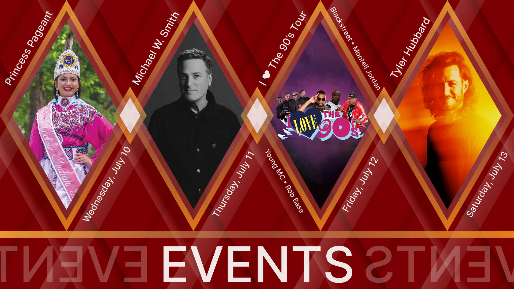
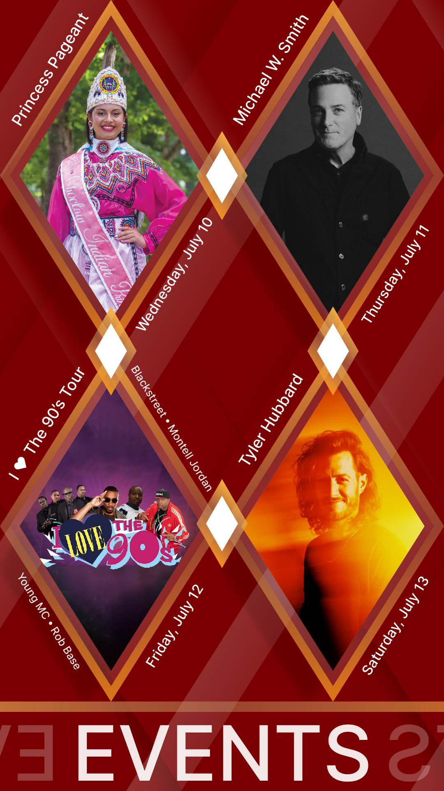

<section class="diamond-bg">
  

    
    
    
    <h2 class="display-2 shadow-text pt-5">2024 Fair Schedule Coming Soon!</h2>
    <!--{% assign cachedNow = 'now' | date: '%Y-%m-%d' %}
    <ul class="nav nav-pills nav-fill h5" id="myTab" role="tablist">
      
      
      
      
      
      
      
      
      
      
    </ul>
    

      <button type="button" class="btn btn-lg btn-outline-secondary active" data-filter="all">All</button>
      <button type="button" class="btn btn-lg btn-outline-secondary" data-filter="card-culture">Culture</button>
      <button type="button" class="btn btn-lg btn-outline-secondary" data-filter="card-family">Family Fun</button>
      <button type="button" class="btn btn-lg btn-outline-secondary" data-filter="card-stickball">Stickball</button>
      <button type="button" class="btn btn-lg btn-outline-secondary" data-filter="card-pageant">Pageant</button>
      <button type="button" class="btn btn-lg btn-outline-secondary" data-filter="card-competitions">Competitions</button>
    
-->
    <!-- 

      <input type="checkbox" class="form-check-input" id="card-culture">
      <label class="form-check-label" for="card-culture">Culture</label>
    

    

      <input type="checkbox" class="form-check-input" id="card-family-fun">
      <label class="form-check-label" for="card-family-fun">Family Fun</label>
    

    

      <input type="checkbox" class="form-check-input" id="card-stickball">
      <label class="form-check-label" for="card-stickball">Stickball</label>
    

    

      <input type="checkbox" class="form-check-input" id="card-pageant">
      <label class="form-check-label" for="card-pageant">Pageant</label>
    

    

      <input type="checkbox" class="form-check-input" id="card-competitions">
      <label class="form-check-label" for="card-competitions">Competitions</label>
    
 -->
    <!--

      

        

          
          

            

            

            
              

                
{{ event.hour }}

              

              

                <a href="../{{ event.style }}/" class="text-dark" style="text-decoration: none;">
                <a href="#" class="text-dark" style="text-decoration: none;">
                
                  
{{ event.category }}

                  
{{ event.title }}

                </a>
              

              <a href="../map/" class="text-white" style="text-decoration: none;">
                

                  
<i class="bi bi-geo-alt-fill"></i> {{ event.location }}

                

              </a>
            

          

          
        

      

      

        

          
          

            

            

            
              

                
{{ event.hour }}

              

              

                <a href="../{{ event.style }}/" class="text-dark" style="text-decoration: none;">
                <a href="#" class="text-dark" style="text-decoration: none;">
                
                  
{{ event.category }}

                  
{{ event.title }}

                </a>
              

              <a href="../map/" class="text-white" style="text-decoration: none;">
                

                  
<i class="bi bi-geo-alt-fill"></i> {{ event.location }}

                

              </a>
            

          

          
        

      

      

        

          
          

            

            

            
              

                
{{ event.hour }}

              

              

                <a href="../{{ event.style }}/" class="text-dark" style="text-decoration: none;">
                <a href="#" class="text-dark" style="text-decoration: none;">
                
                  
{{ event.category }}

                  
{{ event.title }}

                </a>
              

              <a href="../map/" class="text-white" style="text-decoration: none;">
                

                  
<i class="bi bi-geo-alt-fill"></i> {{ event.location }}

                

              </a>
            

          

          
        

      

      

        

          
          

            

            

            
              

                
{{ event.hour }}

              

              

                <a href="../{{ event.style }}/" class="text-dark" style="text-decoration: none;">
                <a href="#" class="text-dark" style="text-decoration: none;">
                
                  
{{ event.category }}

                  
{{ event.title }}

                </a>
              

              <a href="../map/" class="text-white" style="text-decoration: none;">
                

                  
<i class="bi bi-geo-alt-fill"></i> {{ event.location }}

                

              </a>
            

          

          
        

      

      

        

          
          

            

            

            
              

                
{{ event.hour }}

              

              

                <a href="../{{ event.style }}/" class="text-dark" style="text-decoration: none;">
                <a href="#" class="text-dark" style="text-decoration: none;">
                
                  
{{ event.category }}

                  
{{ event.title }}

                </a>
              

              <a href="../map/" class="text-white" style="text-decoration: none;">
                

                  
<i class="bi bi-geo-alt-fill"></i> {{ event.location }}

                

              </a>
            

          

          
        

      

      

        

          
          

            

            

            
              

                
{{ event.hour }}

              

              

                <a href="../{{ event.style }}/" class="text-dark" style="text-decoration: none;">
                <a href="#" class="text-dark" style="text-decoration: none;">
                
                  
{{ event.category }}

                  
{{ event.title }}

                </a>
              

              <a href="../map/" class="text-white" style="text-decoration: none;">
                

                  
<i class="bi bi-geo-alt-fill"></i> {{ event.location }}

                

              </a>
            

          

          
        

      

      

        

          
          

            

            

            
              

                
{{ event.hour }}

              

              

                <a href="../{{ event.style }}/" class="text-dark" style="text-decoration: none;">
                <a href="#" class="text-dark" style="text-decoration: none;">
                
                  
{{ event.category }}

                  
{{ event.title }}

                </a>
              

              <a href="../map/" class="text-white" style="text-decoration: none;">
                

                  
<i class="bi bi-geo-alt-fill"></i> {{ event.location }}

                

              </a>
            

          

          
        

      

      

        

          
          

            

            

            
              

                
{{ event.hour }}

              

              

                <a href="../{{ event.style }}/" class="text-dark" style="text-decoration: none;">
                <a href="#" class="text-dark" style="text-decoration: none;">
                
                  
{{ event.category }}

                  
{{ event.title }}

                </a>
              

              <a href="../map/" class="text-white" style="text-decoration: none;">
                

                  
<i class="bi bi-geo-alt-fill"></i> {{ event.location }}

                

              </a>
            

          

          
        

      

      

        

          
          

            

            

            
              

                
{{ event.hour }}

              

              

                <a href="../{{ event.style }}/" class="text-dark" style="text-decoration: none;">
                <a href="#" class="text-dark" style="text-decoration: none;">
                
                  
{{ event.category }}

                  
{{ event.title }}

                </a>
              

              <a href="../map/" class="text-white" style="text-decoration: none;">
                

                  
<i class="bi bi-geo-alt-fill"></i> {{ event.location }}

                

              </a>
            

          

          
        

      

      
= '2023-07-15' %} show active" id="dayTen" role="tabpanel" aria-labelledby="dayTen-tab">
        

          
          

            

            

            
              

                
{{ event.hour }}

              

              

                <a href="../{{ event.style }}/" class="text-dark" style="text-decoration: none;">
                <a href="#" class="text-dark" style="text-decoration: none;">
                
                  
{{ event.category }}

                  
{{ event.title }}

                </a>
              

              <a href="../map/" class="text-white" style="text-decoration: none;">
                

                  
<i class="bi bi-geo-alt-fill"></i> {{ event.location }}

                

              </a>
            

          

          
        

      

    
-->
  

</section>

