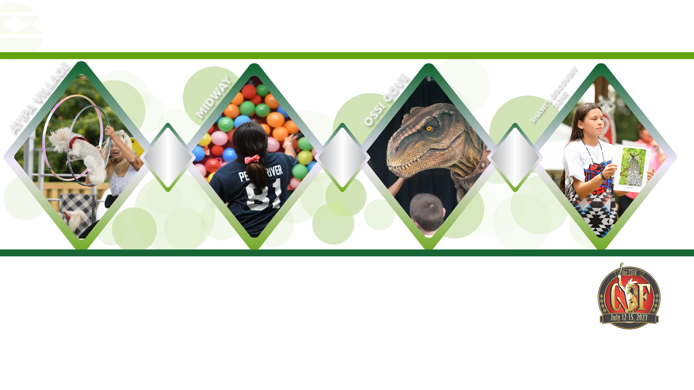

<section class="diamond-bg7">
  

    
    
    

      
      

        

          

            

              
              

                <h5 class="card-title">Stickball Demonstration</h5>
                
Members of the Stickball Field Crew will be demonstrating aspects of Choctaw Stickball, explaining the history and rules, how to handle the sticks during a game, and more. A "Stickball Shootout" will be held for visitors to participate in after the demonstration.

              

            

          

          

            

              
              

                <h5 class="card-title">Frybread Demonstration</h5>
                
Local fry bread cooks will offer a step-by-step process of making fry bread. After the demonstration, those in attendance will have the opportunity to taste a delicious fry bread portion.

              

            

          

          

            

              
              

                <h5 class="card-title">Cultural Video Features</h5>
                
The Mississippi Choctaws of today carry on the traditions left to them by their ancestors. Enjoy our series of videos highlighting cultural topics and learn more about the cultural life ways of the Mississippi Band of Choctaw Indians.

              

            

          

        

      

    
 <!-- End of Ayipa Village -->
    

      
      

        

          

            

              
              

                <h5 class="card-title">YAMMA ÁCHI ÁWASHÓHA</h5>
                
Yamma Áchi Áwashóha is a twist on the classic Bingo game. YAMMA 4x4 game cards will feature bright Choctaw cultural pictures based on the daily theme. A Choctaw speaker will call out clues in the Choctaw language that match the pictures. Players will hear the Choctaw clues and mark their cards

              

            

          

          

            

              
              

                <h5 class="card-title">OTHER FREE ACTIVITES</h5>
                
Other Shawi's Discovery Zone activities include: <strong>Bungee Trampoline, Bounce Houses, Rock Wall, and the CIF Kids Train</strong>.

              

            

          

        

      

    
 <!-- End of Shawi's Discovery Zone -->
  

</section>
