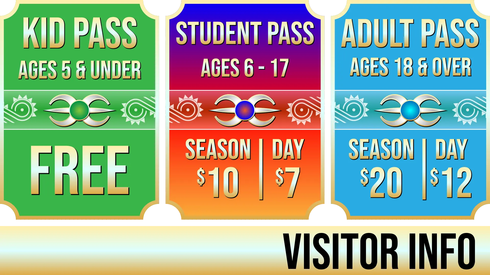
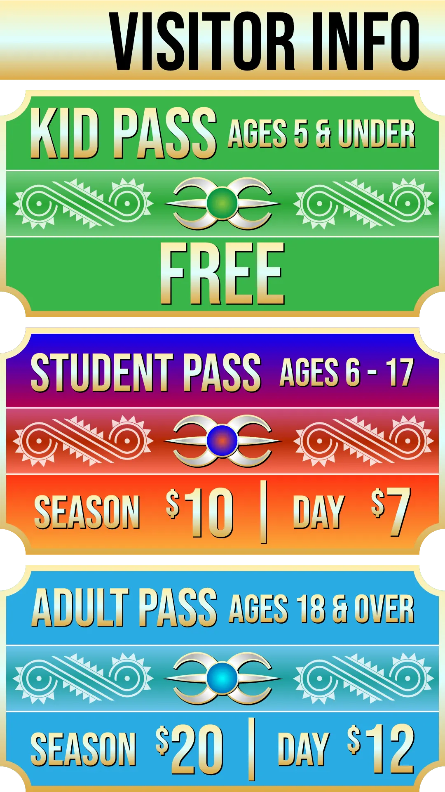

<section class="diamond-bg7">
    

        
        
        <!---->
        
        

            <iframe src="https://www.google.com/maps/d/embed?mid=1e6Nvl9pSDrBdsh-9WWbGf3-QLdrcyGsm&ehbc=2E312F"></iframe>
        

    

</section>
