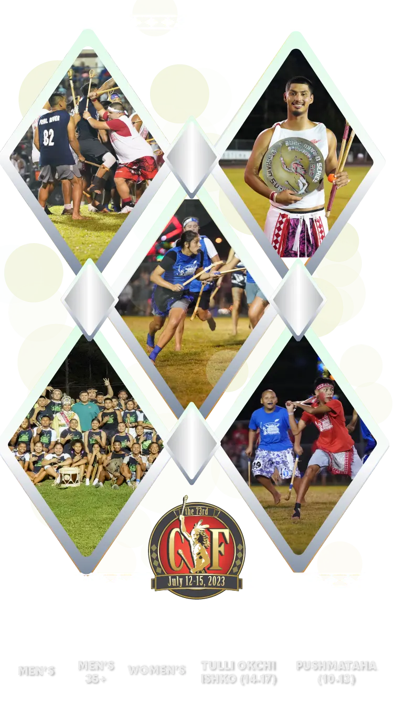

<section class="diamond-bg2 bebas">
  

    
    
    {% assign cachedNow = 'now' | date: '%F %T' %}
     
      
    
    <!--Men's Division-->
    <h2 class="display-2 shadow-text pt-5">2022 Men's Division</h2>
    

      
      

        <a type="button" data-bs-toggle="modal" data-bs-target="#mens-g{{ card.game }}"
          style="text-decoration: none;">
          

            

              
{{ card.team1 }}

              
{{ card.team1score }}

            

            

              
              

                
GAME {{ card.game }}

              

              
{{ card.date }} {{ card.hour }}

            

            

              
{{ card.team2 }}

              
{{ card.team2score }}

            

          

        </a>
      

      
      
      
      
      
      
      
      
      
      
    

    <!--Women's Division-->
    <h2 class="display-2 shadow-text pt-5">2022 Women's Division</h2>
    

      
      

        <a type="button" data-bs-toggle="modal" data-bs-target="#womens-g{{ card.game }}"
          style="text-decoration: none;">
          

            

              
{{ card.team1 }}

              
{{ card.team1score }}

            

            

              
              

                
GAME {{ card.game }}

              

              
{{ card.date }} {{ card.hour }}

            

            

              
{{ card.team2 }}

              
{{ card.team2score }}

            

          

        </a>
      

      
    

    <!--Men's (35+) Division-->
    <h2 class="display-2 shadow-text pt-5">2022 Men's (35+) Division</h2>
    

      
      

        <a type="button" data-bs-toggle="modal" data-bs-target="#mens35-g{{ card.game }}"
          style="text-decoration: none;">
          

            

              
{{ card.team1 }}

              
{{ card.team1score }}

            

            

              
              

                
GAME {{ card.game }}

              

              
{{ card.date }} {{ card.hour }}

            

            

              
{{ card.team2 }}

              
{{ card.team2score }}

            

          

        </a>
      

      
      
      
      
      
      
    

    <!--Tulli Okchi Ishko (14-17) Division-->
    <h2 class="display-2 shadow-text pt-5">2022 Tulli Okchi Ishko (14-17) Division</h2>
    

      
      

        <a type="button" data-bs-toggle="modal" data-bs-target="#tulli-g{{ card.game }}"
          style="text-decoration: none;">
          

            

              
{{ card.team1 }}

              
{{ card.team1score }}

            

            

              
              

                
GAME {{ card.game }}

              

              
{{ card.date }} {{ card.hour }}

            

            

              
{{ card.team2 }}

              
{{ card.team2score }}

            

          

        </a>
      

      
    

    <!--Pushmataha (10-13) Division-->
    <h2 class="display-2 shadow-text pt-5">2022 Pushmataha (10-13) Division</h2>
    

      
      

        <a type="button" data-bs-toggle="modal" data-bs-target="#push-g{{ card.game }}"
          style="text-decoration: none;">
          

            

              
{{ card.team1 }}

              
{{ card.team1score }}

            

            

              
              

                
GAME {{ card.game }}

              

              
{{ card.date }} {{ card.hour }}

            

            

              
{{ card.team2 }}

              
{{ card.team2score }}

            

          

        </a>
      

      
    

  

</section>
